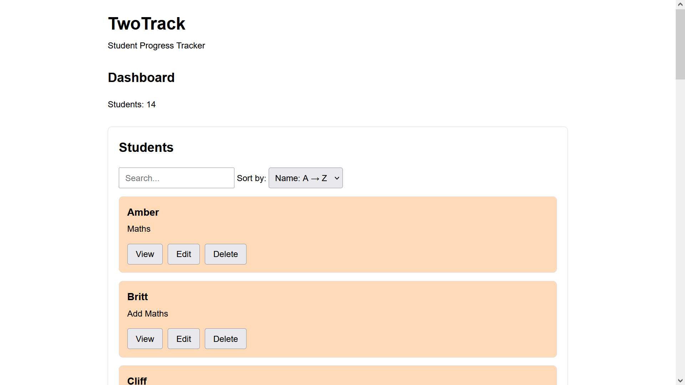
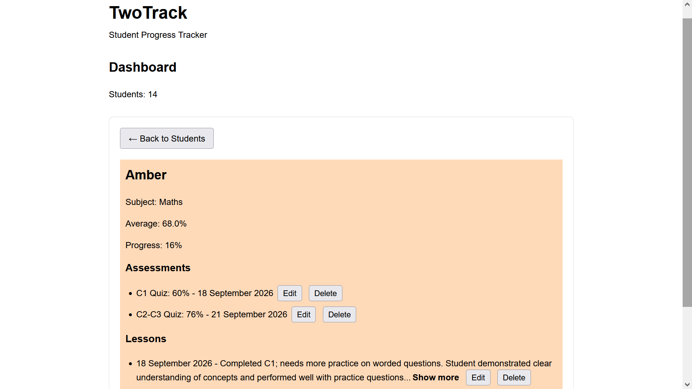

# TwoTrack

TwoTrack is a browser-based student progress tracker built with HTML, CSS, and JavaScript. It is designed for tutors who need to organize student information, record assessments and lesson notes, and keep track of student progress all in one place.




## Features

- Add and manage student records
- Record assessment scores and calculate average scores
- Track changes in assessment performance
- Add, edit, and delete assessment records
- Add, edit, and delete lesson notes
- Expand and collapse long lesson notes
- Search for students by name or subject
- Filter and sort student records
- View individual student progress
- Save student data using browser localStorage
- Responsive layout for desktop and mobile screens

## Technologies

- HTML5
- CSS3
- JavaScript
- Browser localStorage
- GitHub
- GitHub Pages

## Live Demo

[View TwoTrack](https://sarveen17.github.io/tutor-tracker/)

## Getting Started

### Run locally

1. Clone this repository:

   ```bash
   git clone https://github.com/sarveen17/tutor-tracker.git
   ```

2. Open the project folder.
3. Open index.html in a web browser.

No external dependencies or installation steps are required.

### Using the application

1. Add a student using the student form.
2. Select a student to open their individual progress view.
3. Add assessment results and lesson notes.
4. Edit or delete existing records when needed.
5. Use the search, filter, and sorting controls to find students quickly.
6. Student data is automatically saved in the browser using localStorage.

## Project Structure

```text
TwoTrack/
├── index.html
├── style.css
├── script.js
└── README.md
```

## Future Improvements

Possible future improvements include:

- Further refactoring and simplification of the JavaScript
- More detailed progress visualizations
- Additional assessment statistics
- Improved data management and export options
- Further UI and accessibility improvements

## Author

Developed by Sarveen as a portfolio project.
